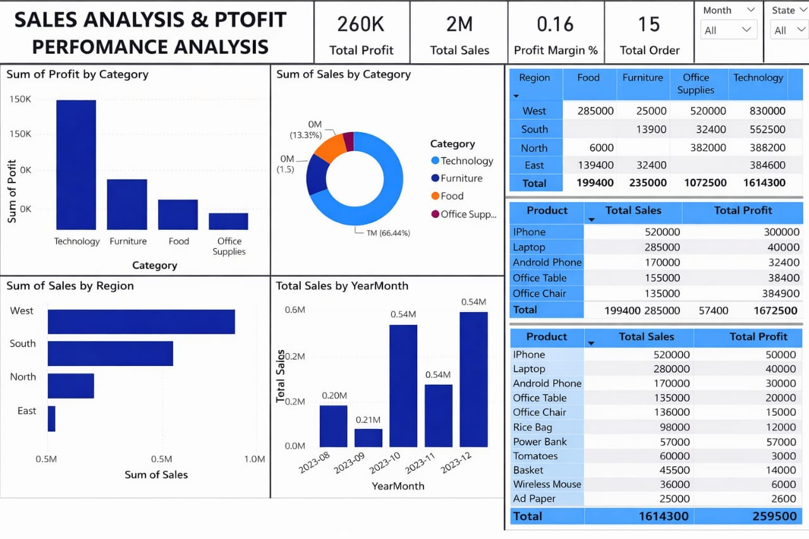

# Sales-Analysis-PowerBI
Power BI dashboard analyzing sales, profit, and regional performance.
# 📊 Sales Analysis & Profit Performance Dashboard

## 🔍 Project Overview
This Power BI dashboard analyzes sales and profit performance across categories, regions, and time periods.

## 🎯 Objectives
- Identify top-performing product categories
- Analyze regional sales distribution
- Track monthly sales trends
- Monitor profit margins

## 📌 Key Insights
- Technology is the highest revenue-generating category
- West region leads in sales performance
- Strong upward trend in monthly sales

## 🛠 Tools Used
- Power BI
- Power Query
- DAX
- Excel (Data Source)

## 📷 Dashboard Preview

